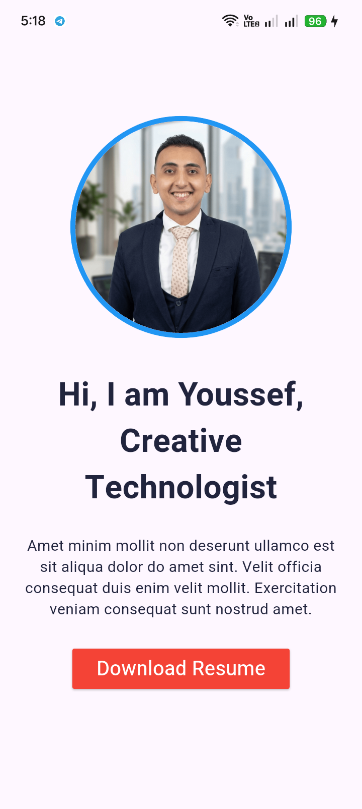

# 👨‍💻 Profile Card App


A simple and clean **Profile Card mobile application built with Flutter**.

This project was created to practice the fundamentals of Flutter by building a static profile screen with a profile image, personal information, custom typography, and a styled button.

---

## 🎯 Project Objectives

The main objectives of this project were to practice:

* Understanding the Flutter widget system
* Using `StatelessWidget`
* Understanding the `build()` method
* Using `MaterialApp` and `Scaffold`
* Building layouts with `Center` and `Column`
* Creating circular profile images using `CircleAvatar`
* Nesting widgets to create a bordered profile image
* Styling text using `TextStyle`
* Using a custom font family
* Adding spacing with `SizedBox`
* Adding padding with `Padding` and `EdgeInsets`
* Creating a styled `ElevatedButton`
* Customizing button shape, background color, and text color
* Working with local image and font assets

---

## ✨ Features

* 👤 Circular profile image with a colored border
* 👋 Personal greeting and introduction
* 📝 Short profile description
* 🔴 Styled "Download Resume" button
* 🔤 Custom Heebo font
* 📱 Centered and responsive layout
* ⚡ Simple and clean user interface

> **Note:** The "Download Resume" button is currently a UI element only and does not perform an action.

---

## 🛠️ Technologies Used

* **Flutter**
* **Dart**
* **Material Design**

### Flutter Widgets Used

* `MaterialApp`
* `Scaffold`
* `Center`
* `Column`
* `CircleAvatar`
* `Text`
* `Padding`
* `SizedBox`
* `ElevatedButton`

### Other Concepts

* `StatelessWidget`
* `TextStyle`
* `EdgeInsets`
* `RoundedRectangleBorder`
* `AssetImage`
* Custom Fonts
* Local Assets

---

## 📂 Project Structure

```text
profile-card/
│
├── lib/
│   └── main.dart
│
├── assets/
│   ├── images/
│   │   ├── Photo.png
│   │   └── img.png
│   │
│   └── fonts/
│       └── Heebo-VariableFont_wght.ttf
│
├── pubspec.yaml
└── README.md
```

---

## 📱 App Preview

<p align="center">
  
</p>

---

## 🧠 What I Learned

This project helped me practice building a static profile screen and understand how Flutter widgets can be combined to create a clean user interface.

Through this project, I practiced:

* Creating a Flutter application
* Understanding `main()` as the entry point of the application
* Using `runApp()` to start the application
* Creating and using `StatelessWidget`
* Understanding the role of the `build()` method
* Building a UI using Flutter's widget tree
* Using `CircleAvatar` to display a circular profile image
* Nesting `CircleAvatar` widgets to create a colored border
* Using `Column` to arrange widgets vertically
* Using `Center` to align the main content
* Adding spacing using `SizedBox`
* Adding padding using `Padding`
* Styling text using `TextStyle`
* Registering and using a custom font
* Customizing an `ElevatedButton`
* Working with local image and font assets

---

## 🚀 Getting Started

### Prerequisites

Before running this project, make sure you have:

* Flutter SDK
* Android Studio or Visual Studio Code
* Flutter and Dart extensions

You can check your Flutter installation using:

```bash
flutter doctor
```

### Installation

#### 1. Clone the repository

```bash
git clone https://github.com/youssefmohamedflutter/profile-card.git
```

#### 2. Navigate to the project directory

```bash
cd profile-card
```

#### 3. Install dependencies

```bash
flutter pub get
```

#### 4. Run the application

```bash
flutter run
```

---

## 🔤 Custom Font

This project uses the **Heebo** font.

Make sure the font is registered correctly in `pubspec.yaml`:

```yaml
flutter:
  fonts:
    - family: Heebo-VariableFont_wght
      fonts:
        - asset: assets/fonts/Heebo-VariableFont_wght.ttf
```

The font is then used in the application through:

```dart
fontFamily: 'Heebo-VariableFont_wght'
```

---

## 👨‍💻 Author

### Youssef Mohamed

**Flutter Developer**

* 💼 LinkedIn: [Youssef Mohamed](https://www.linkedin.com/in/youssef-gado-7a2891423/)
* 💻 GitHub: [youssefmohamedflutter](https://github.com/youssefmohamedflutter)

---

## ⭐ Support

If you like this project, don't forget to give the repository a **star ⭐**.

---

## 📄 License

This project is licensed under the **MIT License**.
