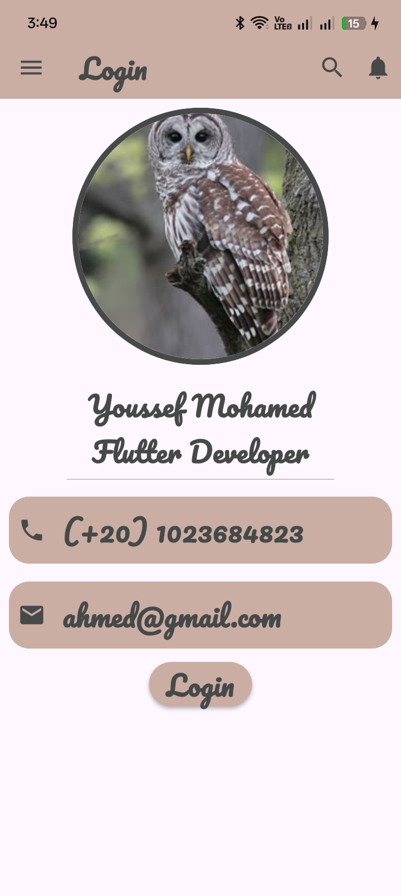

# 🪪 Business Card App


A simple and elegant **Flutter Business Card application** that showcases personal information with a clean and modern user interface.

This project was built to practice Flutter fundamentals, including layouts, widgets, custom fonts, images, and responsive UI design.

---

## 📱 Preview

<p align="center">
  
</p>

---

## 🎯 Project Objectives

- Practice building UI layouts using Flutter widgets.
- Understand how to use **Column**, **Row**, **Padding**, and **Container**.
- Learn to display profile images using **CircleAvatar**.
- Practice text styling and custom typography.
- Build clean and reusable Flutter UI components.

---

## ✨ Features

- 👤 Circular profile image
- 📝 Display personal name and job title
- 📞 Phone information card
- 📧 Email information card
- 🎨 Custom color palette
- 🔤 Pacifico custom font
- 📱 Responsive layout using `SingleChildScrollView`
- ⚡ Clean and simple UI

---

## 🎨 Color Palette

| Color | Hex Code | Usage |
|--------|----------|-------|
| Primary | `#CAAEA3` | AppBar, Cards, Button |
| Secondary | `#474948` | Text and Icons |

---

## 🛠️ Technologies Used

- Flutter
- Dart
- Material Design
- Custom Fonts
- CircleAvatar
- Column & Row
- Container
- SingleChildScrollView

---

## 📂 Project Structure

```text
business-card/
├── lib/
│   └── main.dart
├── assets/
│   ├── images/
│   │   ├── birds.jpg
│   │   └── Screenshot_Profile_app.png
│   └── fonts/
│       └── Pacifico-Regular.ttf
├── pubspec.yaml
└── README.md
```

---

## 📋 Prerequisites

Before running this project, make sure you have:

- Flutter SDK (3.0.0 or later)
- Android Studio or Visual Studio Code
- Flutter & Dart extensions

---

## 🚀 Getting Started

### Clone the repository

```bash
git clone https://github.com/youssefmohamedflutter/business-card.git
```

### Navigate to the project

```bash
cd business-card
```

### Install dependencies

```bash
flutter pub get
```

### Run the application

```bash
flutter run
```

---

## 📚 What I Learned

Through this project I learned how to:

- Build Flutter layouts using widgets
- Use `CircleAvatar` with local assets
- Style text with custom fonts
- Organize Flutter assets
- Create reusable and clean UI components
- Structure a Flutter project professionally

---

## 👨‍💻 Author

**Youssef Gado**

Flutter Developer

- 💼 LinkedIn: https://www.linkedin.com/in/youssef-gado-7a2891423/
- 💻 GitHub: https://github.com/youssefmohamedflutter

---

## ⭐ Support

If you found this project useful, don't forget to leave a ⭐ on the repository.

---

## 📄 License

This project is licensed under the **MIT License**.
